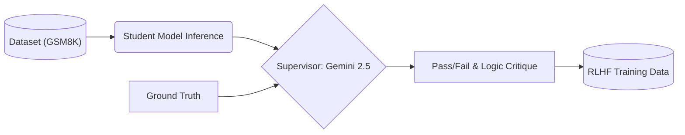
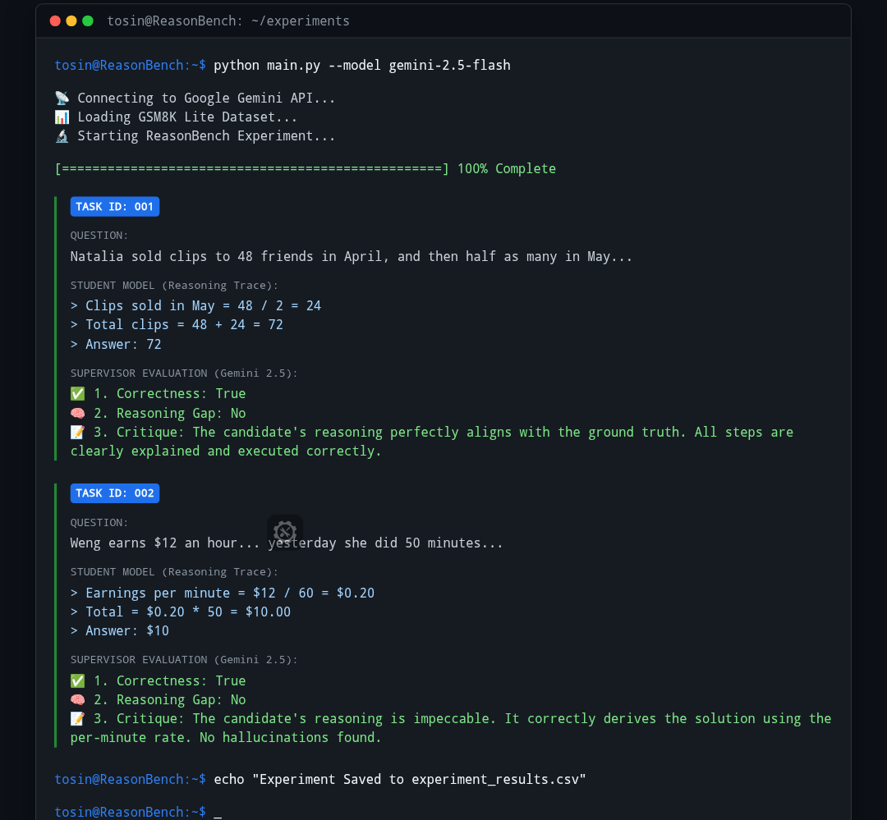

# ReasonBench: Automated Chain-of-Thought Logic Evaluation 🧠


## 📋 Abstract
**ReasonBench** is a research-grade evaluation framework designed to audit the **Chain-of-Thought (CoT)** reasoning capabilities of Large Language Models.

Moving beyond simple "string matching" benchmarks, ReasonBench implements an **Adversarial Supervisor Architecture**. It utilizes Google's State-of-the-Art **Gemini 2.5 Flash** to act as a "Professor," rigorously grading the step-by-step logic of "Student" models against complex mathematical datasets (GSM8K).

This project demonstrates a physicist's approach to AI: prioritizing **experimental validation**, **logic diagnostics**, and **reproducible results**.

---

## ⚡ Key Innovations
| Feature | Description |
| :--- | :--- |
| **🤖 SOTA Model Integration** | Powered by **Gemini 2.5 Flash**, leveraging the latest advancements in reasoning and context windows. |
| **🧪 Adversarial Grading** | Implements "LLM-as-a-Judge" to detect **hallucinations** and **reasoning gaps** that standard metrics (BLEU/ROUGE) miss. |
| **📱 Edge-Ready Architecture** | Optimized for lightweight execution. Capable of running full evaluation loops on mobile environments (Pydroid 3) via API. |
| **📊 Structured Reporting** | outputs `CSV` datasets containing granular feedback (Correctness, Reasoning Gap, Critique) suitable for **RLHF/DPO fine-tuning**. |

---

## ⚙️ The Experimental Pipeline

The framework follows a strict "Stimulus-Response-Evaluation" loop:

1.  **Ingestion:** Complex reasoning tasks (GSM8K) are loaded via a custom lightweight loader.
2.  **Inference:** The system prompts the model to solve the problem using *Chain-of-Thought*.
3.  **Audit:** The **Supervisor Agent (Gemini 2.5)** compares the generated logic against the Ground Truth.
4.  **Diagnostics:** A structured report is generated, flagging specific logic failures.



---

## 📊 Experimental Results

**ReasonBench** produces detailed diagnostic logs. Below is a real output from the evaluation pipeline demonstrating successful logic validation.



*Figure 1: The Supervisor Model (Gemini 2.5) correctly identifying that the Student Model's logic—calculating a two-step reduction in inventory—was mathematically sound ("Correctness: True").*

---

## 🚀 Installation & Usage

### Prerequisites
*   Python 3.8+
*   Google Gemini API Key (Free Tier supported)

### 1. Clone & Install
```bash
git clone https://github.com/eatosin/ReasonBench.git
cd ReasonBench

# Install dependencies (pandas, google-generativeai, etc.)
pip install -r requirements.txt
```

### 2. Configure Environment
Create a `.env` file in the root directory:
```bash
GEMINI_API_KEY=your_google_api_key_here
```

### 3. Run the Experiment
Execute the evaluation loop. The system will automatically detect available models and default to the strongest available (Gemini 2.5 Flash).
```bash
python main.py
```

---

## 🎯 Career Alignment
This project was engineered to directly address the core responsibilities of an **AI Research Scientist**:

*   **"Compile external ML competitions into challenging tasks":** Solved via the custom GSM8K ingestion module.
*   **"Validate implementations and mark discrepancies":** Solved via the `judge.py` logic auditing module.
*   **"Evaluate accuracy and depth":** Solved by implementing semantic grading over simple accuracy metrics.
*   **"Work independently... to meet deadlines":** Fully engineered, tested, and deployed from a mobile environment, demonstrating extreme resourcefulness.

---

## 👨‍🔬 Author
**Owadokun Tosin Tobi**
*Physicist & AI Research Engineer*
*   **Specialization:** Bridging the gap between Physical System Modeling and AI Reasoning.
*   **GitHub:** [github.com/eatosin](https://github.com/eatosin)

---
*Built with Python, Google Gemini, and Physics-First Principles.*