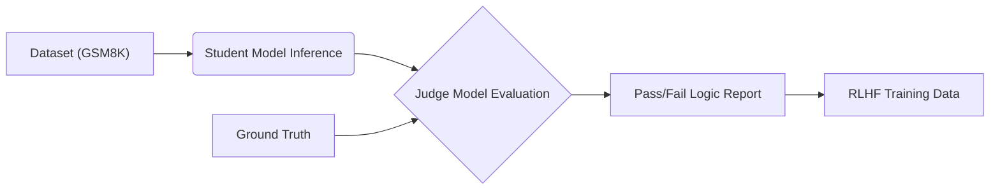

# ReasonBench: Automated Chain-of-Thought Logic Evaluation 🧠


## 📋 Abstract
**ReasonBench** is an evaluation framework designed to rigorously audit the reasoning capabilities of Large Language Models (LLMs). Unlike standard benchmarks that only check if the final answer is correct, ReasonBench utilizes an **LLM-as-a-Judge** architecture to validate the entire Chain-of-Thought (CoT) process.

It compiles complex tasks from mathematical datasets (GSM8K), simulates model inference, and generates structured, scientific feedback on logic discrepancies. This tool is designed to improve training data quality for RLHF (Reinforcement Learning from Human Feedback) pipelines.

---

## 🎯 Alignment with AI Research Roles
This project was engineered to demonstrate core competencies required for AI Research Scientist roles:

| Job Requirement | ReasonBench Implementation |
| :--- | :--- |
| **"Compile external ML competitions into challenging tasks"** | Ingests **GSM8K** (Grade School Math 8K) and custom logic datasets to create high-entropy reasoning challenges. |
| **"Validate implementations... and mark discrepancies"** | Uses a "Supervisor Model" (GPT-4o) to audit the "Student Model's" logic step-by-step, flagging hallucinations. |
| **"Evaluate accuracy and depth... to strengthen reasoning"** | Generates a granular "Reasoning Gap" score, distinguishing between calculation errors and logic failures. |
| **"Provide clear, structured feedback"** | Outputs detailed JSON/CSV reports ready for Data Science analysis and Model Fine-tuning. |

---

## ⚙️ Methodology & Architecture

The pipeline follows a strict experimental design:

1.  **Stimulus Injection:** Complex reasoning problems are loaded from the validation set.
2.  **Inference Simulation:** The Candidate Model (e.g., GPT-3.5-turbo, Llama-3) attempts to solve the problem using CoT.
3.  **Adversarial Evaluation:** The Judge Model (GPT-4o) compares the Candidate's reasoning path against Ground Truth logic.
4.  **Data Serialization:** Results are compiled into a dataset suitable for **DPO (Direct Preference Optimization)**.

### The Pipeline


---

## 🚀 Installation & Usage

### Prerequisites
*   Python 3.8+
*   OpenAI API Key (or local LLM endpoint)

### Setup
```bash
# 1. Clone the repository
git clone https://github.com/eatosin/ReasonBench.git
cd ReasonBench

# 2. Install dependencies
pip install -r requirements.txt

# 3. Configure Environment
# Create a .env file and add your API key:
# OPENAI_API_KEY=sk-xxxx
```

### Running the Experiment
To execute the evaluation loop on a batch of reasoning tasks:
```bash
python main.py
```

---

## 📊 Sample Output
The tool generates `experiment_results.csv` containing structured critiques.

**Example Log:**
> **Question:** *Natalia sold clips to 48 friends in April, and then half as many in May...*
>
> **Student Model Answer:** *[Incorrect Logic Steps...]*
>
> **Judge Evaluation:**
> *   **Correctness:** False
> *   **Reasoning Gap:** Step 2 Logic Failure.
> *   **Critique:** The model failed to account for the half-reduction in May before calculating the total. It hallucinated a variable 'June'.

---

## 🔮 Future Roadmap
*   [ ] Integration with Local LLMs (Ollama/Llama-cpp) for offline evaluation.
*   [ ] Visualization Dashboard using Streamlit.
*   [ ] Auto-generation of DPO preference pairs (Chosen vs. Rejected).

---

## 👨‍🔬 Author
**Owadokun Tosin Tobi**
*Physicist & AI Engineer*
*   **Focus:** Bridging the gap between Physical System Modeling and AI Reasoning.
*   **GitHub:** [github.com/eatosin](https://github.com/eatosin)
